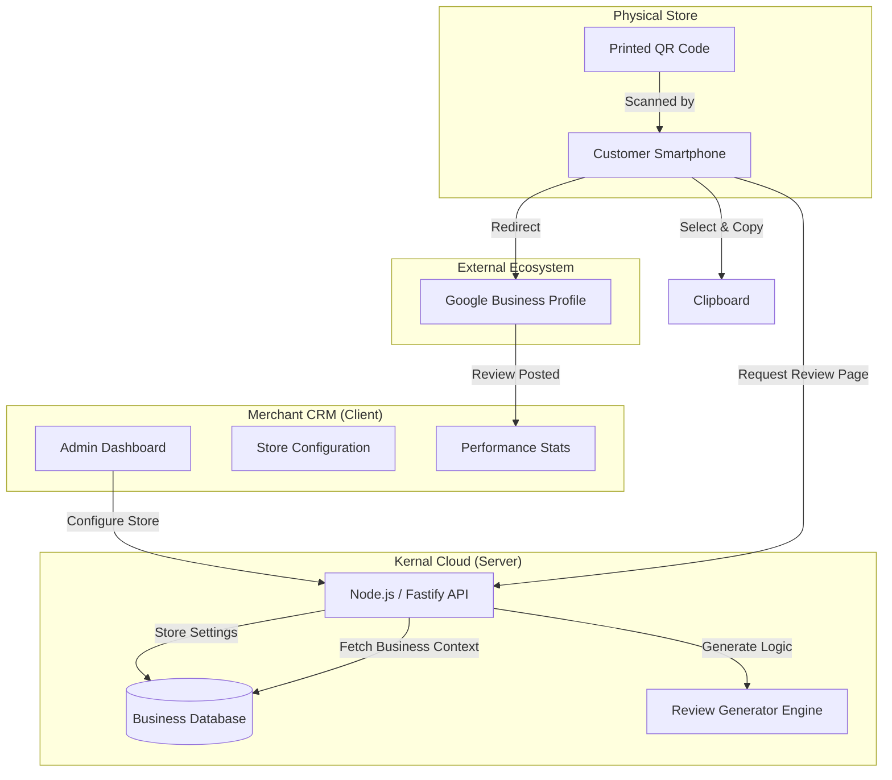
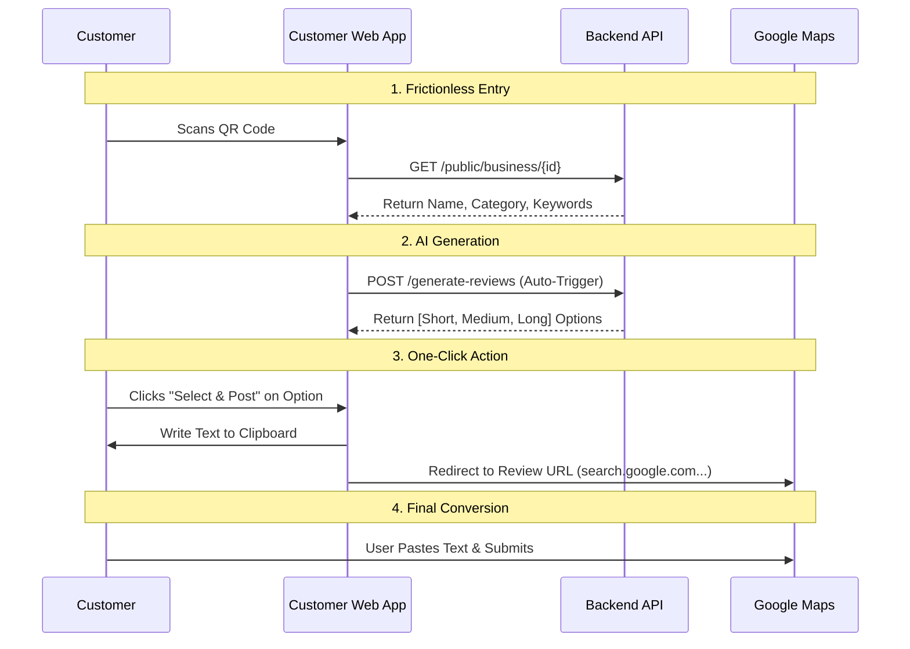

# Kernal Review CRM — Technical Architecture

## 1. System Overview

This system is designed to bridge the physical customer experience with digital reputation management (Google Business Profile). It focuses on **frictionless review generation** by using AI to suggest personalized, policy-compliant reviews for customers, reducing the cognitive load of writing a review.

### Core Components
1.  **Merchant CRM (Web Dashboard)**: For business owners to manage connection, view stats, and generate QR codes.
2.  **Customer Review Interface (Mobile Web)**: For customers to scan, select a review, and post.
3.  **Backend API (Node.js)**: Handles business logic, session management, and simulated GMB integration.

---

## 2. Architecture Diagrams

### A. High-Level Data Flow

### B. User Journey Flow (The "Kernal" Logic)

---

## 3. Tech Stack

### Frontend (Client)
*   **Framework**: Next.js 14+ (React)
    *   *Why*: Server-Side Rendering (SSR) for fast initial mobile loads; standard for scalable web apps.
*   **Language**: TypeScript
    *   *Why*: Type safety shared with backend types.
*   **Styling**: Vanilla CSS (CSS Modules / Global)
    *   *Why*: Lightweight, premium "Glassmorphism" custom design without framework bloat.
*   **State**: React Hooks (`useState`, `useEffect`).

### Backend (Server)
*   **Runtime**: Node.js
*   **Framework**: Fastify
    *   *Why*: Significantly faster than Express; lower overhead for high-concurrency QR scans.
*   **Language**: TypeScript
*   **Database (MVP)**: In-Memory / JSON File (Mock)
    *   *Scaling*: Move to PostgreSQL or MongoDB for production.
*   **Libraries**:
    *   `qrcode`: For generating print-ready QR images.
    *   `fastify-cors`: For handling client-server communication.

---

## 4. API Endpoints

| Method | Endpoint | Purpose |
| :--- | :--- | :--- |
| `GET` | `/business/:id` | Fetch merchant status (dashboard) |
| `POST` | `/business/:id/update` | Update store config (Place ID, URL) |
| `GET` | `/business/:id/qr` | Generate QR code image |
| `POST` | `/business/:id/refresh-stats` | Fetch latest GMB stats (reviews count) |
| `GET` | `/public/business/:id` | Public read-only context for customers |
| `POST` | `/generate-reviews` | Core logic to generate 3 review options |

---

## 5. Deployment Strategy

*   **Frontend**: Vercel (Recommended) or Netlify.
*   **Backend**: Render, Railway, or AWS Lambda.
*   **Environment Variables**:
    *   `GMB_CLIENT_ID`: Google OAuth Client ID.
    *   `GMB_CLIENT_SECRET`: Google OAuth Secret.
    *   `API_KEY`: Internal security keys.

---
**Prepared for Development Team** | *Kernal GMB CRM MVP*
